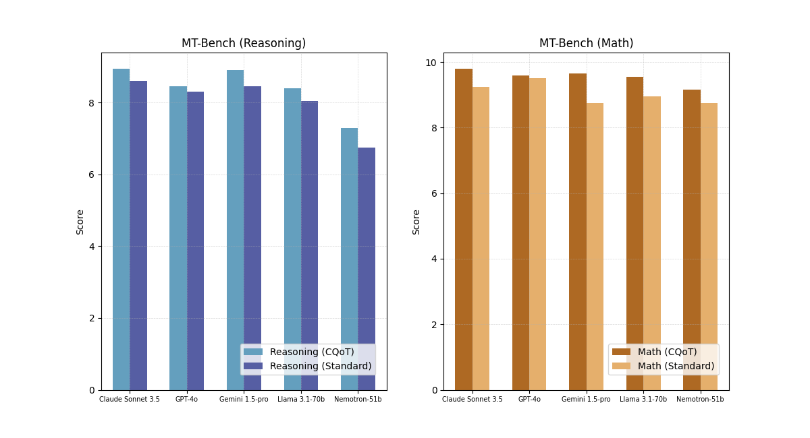

# Critical-Questions-of-Thought: Steering LLM reasoning with Argumentative Querying

Combining argumentation theories, leveraging Toulmin's argument schema and the notions of critical questions, with the test-time compute paradigm enables LLMs' higher performances on logical and mathematical tasks. In particular, the probing action of the critical questions allows the model to adjust its reasoning plan, thus effectively correcting itself in case of wrong assumptions or thinking steps. The ensuing approach, denoted as _Critical-Questions-of-Thought (CQoT)_, is composed of a pipeline rendered herein as a Python script.  


We share the results achieved by the CQoT method as detailed in our [paper](https://arxiv.org/abs/2412.15177).

The colour-coded evals [CQoT_Evals.xlsx](CQoT_Evals.xlsx) present the scores reached by 5 LLMs, both proprietary and open source, on 40 challenging questions retrieved from [MT-Bench Reasoning and Math benchmark](https://huggingface.co/datasets/HuggingFaceH4/mt_bench_prompts). Each model has been tested on its baseline, as well as CoT and CQoT implementation. Scores, assigned by an LLM judge (GPT-4o), span from 1 to 10 and reflect the performance of each model on the specific query. Low-graded responses (1-4) are displayed with a red background. Middle-ranged replies (5-7) are coloured in yellow, whereas good answers (8-10) are showcased in green.


Here we can preview the outcome of the experiments we accomplished to evaluate CQoT. 


If you find our paper or pipeline useful, please consider referencing it:
```
@misc{castagna2024criticalquestionsofthoughtsteeringllmreasoning,
      title={Critical-Questions-of-Thought: Steering LLM reasoning with Argumentative Querying}, 
      author={Federico Castagna and Isabel Sassoon and Simon Parsons},
      year={2024},
      eprint={2412.15177},
      archivePrefix={arXiv},
      primaryClass={cs.AI},
      url={https://arxiv.org/abs/2412.15177}, 
}
